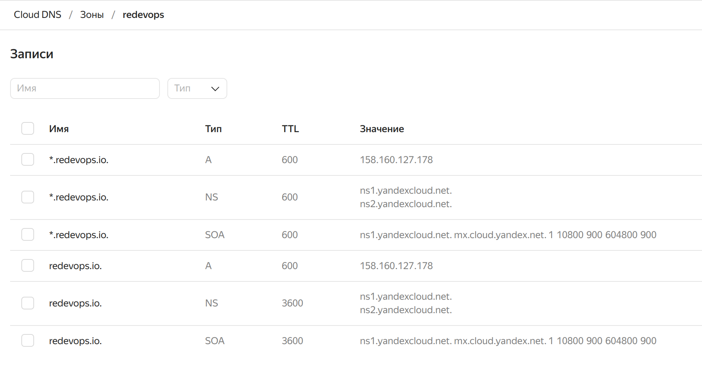
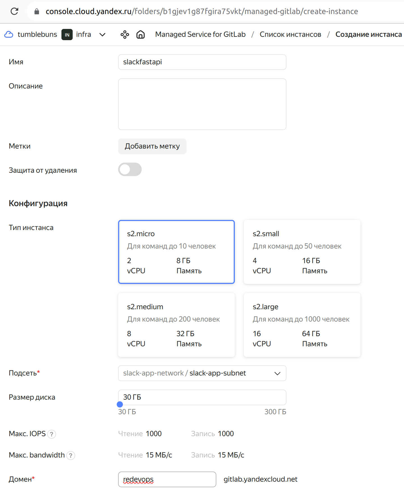
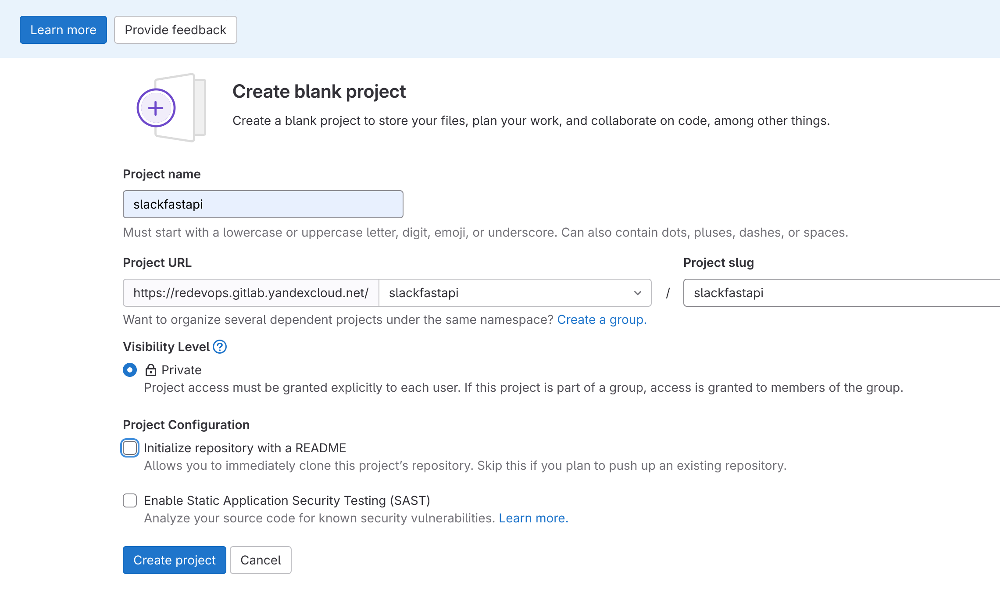

# FastAPI backend for SlackCutter APP
## Table of contents
1. **[Project structure](#project-structure)**
2. **[Poetry](#poetry)**
3. **[Docker](#docker)**
4. **[Configuration](#configuration)**
5. **[Pre-commit](#pre-commit)**
6. **[Kubernetes](#kubernetes)**
7. **[Migrations](#migrations)**
8. **[Running tests](#running-tests)**
9. **[Working with Swagger](#working-with-swagger)**

This project was generated using fastapi_template.


## Project structure

```bash
deploy           # Scripts for deploying
├── kube         # Scripts for deploying in kubernetes cluster
├── docker-compose.dev.yml  # Script for deploy docker compose dev version
├── docker-compose.yml      # Script for deploy docker compose prod version
└── Dockerfile              # Main dockerfile script
slackcutter      # SlackCutter package
trained_model    # SlackCutter ML models
slack_fastapi    # Entry path for FastAPI Backend
├── __main__.py  # Startup script. Starts uvicorn
├── settings.py  # Main configuration settings for project
├── conftest.py  # Fixtures for all tests
├── tests        # Tests for project
├── static       # Static content
├── services     # Package for different external services
├── db           # module contains db configurations
│   ├── dao      # Data Access Objects to interact with DB
│   └── models   # Package contains different models for ORMs
└── web          # Package contains web server. Handlers, startup config
    ├── application.py  # FastAPI application configuration
    └── lifetime.py     # Contains actions to perform on startup and shutdown
    └── api             # Package with all handlers
        ├── router.py   # Main router
        ├── auth        # Module contains authorization logic
        │   ├── views.py      # Authorization endpoints
        │   ├── services.py   # Authorization handlers
        │   ├── schema.py     # Schemas for authorization requests
        │   └── responses.py  # Schemas for authorization responses
        ├── user        # Module contains user operations logic
        │   ├── views.py      # User endpoints configuration
        │   ├── services.py   # User handlers
        │   ├── schema.py     # Schemas for user requests
        │   └── responses.py  # Schemas for user responses
        └── video        # Module contains video operations logic
            ├── views.py      # Video endpoints configuration
            ├── services.py   # Video handlers
            ├── schema.py     # Schemas for video requests
            └── responses.py  # Schemas for video responses
```
[↑](#table-of-contents)
## Poetry

This project uses poetry. It's a modern dependency management
tool.

To run the project use this set of commands:

```bash
poetry install
poetry run python -m slack_fastapi
```

This will start the server on the configured host.

You can find swagger documentation at `/api/docs`.

You can read more about poetry here: https://python-poetry.org/

[↑](#table-of-contents)
## Docker

You can start the project with docker using this command:

```bash
docker-compose -f deploy/docker-compose.yml --project-directory . up --build
```

If you want to develop in docker with autoreload add `-f deploy/docker-compose.dev.yml` to your docker command.
Like this:

```bash
docker-compose -f deploy/docker-compose.yml -f deploy/docker-compose.dev.yml --project-directory . up
```

This command exposes the web application on port 8000, mounts current directory and enables autoreload.

But you have to rebuild image every time you modify `poetry.lock` or `pyproject.toml` with this command:

```bash
docker-compose -f deploy/docker-compose.yml --project-directory . build
```

[↑](#table-of-contents)
## Configuration

This application can be configured with environment variables.

You can create `.env` file in the root directory and place all
environment variables here.

All environment variabels should start with "SLACK_FASTAPI_" prefix.

For example if you see in your "slack_fastapi/settings.py" a variable named like
`random_parameter`, you should provide the "SLACK_FASTAPI_RANDOM_PARAMETER"
variable to configure the value. This behaviour can be changed by overriding `env_prefix` property
in `slack_fastapi.settings.Settings.Config`.

An exmaple of .env file:
```bash
SLACK_FASTAPI_RELOAD="True"
SLACK_FASTAPI_PORT="8000"
SLACK_FASTAPI_ENVIRONMENT="dev"
```

You can read more about BaseSettings class here: https://pydantic-docs.helpmanual.io/usage/settings/

[↑](#table-of-contents)
## Pre-commit

To install pre-commit simply run inside the shell:
```bash
pre-commit install
```

pre-commit is very useful to check your code before publishing it.
It's configured using .pre-commit-config.yaml file.

By default it runs:
* black (formats your code);
* mypy (validates types);
* isort (sorts imports in all files);
* flake8 (spots possibe bugs);
* yesqa (removes useless `# noqa` comments).


You can read more about pre-commit here: https://pre-commit.com/

[↑](#table-of-contents)
## Kubernetes
To run your app in kubernetes
just run:
```bash
kubectl apply -f deploy/kube
```

It will create needed components.

If you haven't pushed to docker registry yet, you can build image locally.

```bash
docker-compose -f deploy/docker-compose.yml --project-directory . build
docker save --output slack_fastapi.tar slack_fastapi:latest
```

[↑](#table-of-contents)
## Migrations

If you want to migrate your database, you should run following commands:
```bash
# To run all migrations untill the migration with revision_id.
alembic upgrade "<revision_id>"

# To perform all pending migrations.
alembic upgrade "head"
```

### Reverting migrations

If you want to revert migrations, you should run:
```bash
# revert all migrations up to: revision_id.
alembic downgrade <revision_id>

# Revert everything.
 alembic downgrade base
```

### Migration generation

To generate migrations you should run:
```bash
# For automatic change detection.
alembic revision --autogenerate

# For empty file generation.
alembic revision
```

[↑](#table-of-contents)
## Running tests

If you want to run it in docker, simply run:

```bash
docker-compose -f deploy/docker-compose.yml --project-directory . run --rm api pytest -vv .
docker-compose -f deploy/docker-compose.yml --project-directory . down
```

For running tests on your local machine.
1. you need to start a database.

I prefer doing it with docker:
```
docker run -p "5432:5432" -e "POSTGRES_PASSWORD=slack_fastapi" -e "POSTGRES_USER=slack_fastapi" -e "POSTGRES_DB=slack_fastapi" postgres:13.8-bullseye
```


2. Run the pytest.
```bash
pytest -vv .
```

[↑](#table-of-contents)
## Working with Swagger

1. Visit **Swagger** page by default on [`127.0.0.1:8000/api/docs`](http://127.0.0.1:8000/api/docs)
2. Register user account by `[POST] /api/auth/register`
3. Confirm email by `[POST] /api/auth/confirm` default code is **1234**
4. Copy `access_token` and `refresh_token` from response of 3.
5. Paste `access_token` into **Authorization** field in the top-right of **Swagger** page
6. Enter user setting by `[PUT] /api/user/settings`. You can see the list of current ML models by `[GET] /api/user/models`.
Default settings is:
   * Max seconds length: 10
   * Model threshold: -1
   * Median hit modificator: 3
   * Noise threshold:
       * min: 10
       * max: 90
   * Audio threshold:
       * min: 25
       * max: 75
   * Crop interval: 1.5
   * Sound check: True
   * Trained model: RanFor_Action Sports.joblib
7. Upload the source video by `[POST] /api/video`
8. Copy video `id` from response of 7.
9. Create clip by `[POST] /api/clip`
10. Download final clip by `[POST] /api/clip/download`

### Deployment instructions
```
git clone http://github.com/arybach/slackfastapi
cd slackfastapi/terraform
terraform init
terraform apply -var-file=terraform.tfvars -auto-approve
terraform output -json > ../ansible/terraform_outputs.json
cd ../ansible
ansible-playbook fetch-creds.yml
```
### update DNS records in yandex CLI


### create managed Gitlab instance via yandex UI



### login using reset link sent to the email provided at Gitlab instance creation
### then create group


### Under Settings -> CI/CD -> expand variables and add docker hub credentials:
```
CI_REGISTRY_USER
CI_REGISTRY_PASSWORD
```
### Create new project for the group


### then push slackfastapi-master to gitlab
```
cd /media/groot/projects/slackfastapi/slackfastapi-master
git init --initial-branch=main # if needed
git remote set-url origin https://redevops.gitlab.yandexcloud.net/slackfastapi/slackfastapi.git
# check
git remote -v
git push --set-upstream origin main

```
